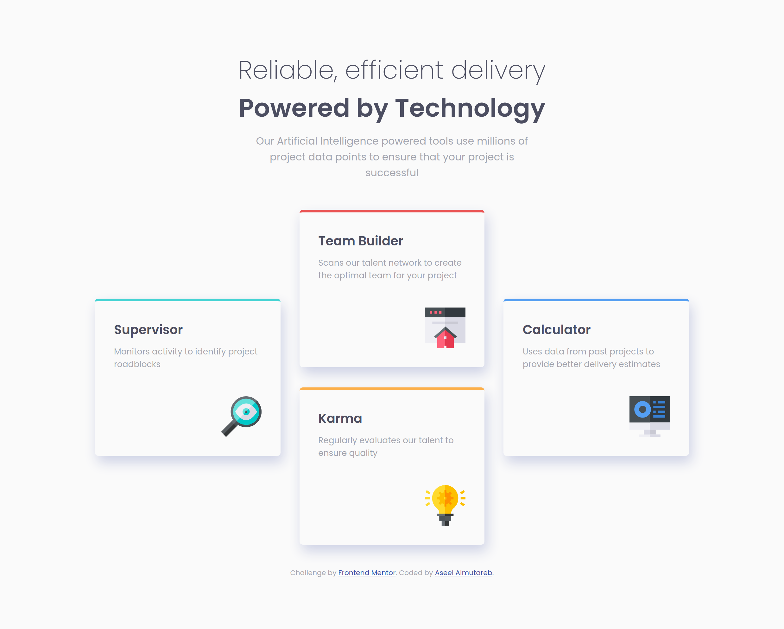
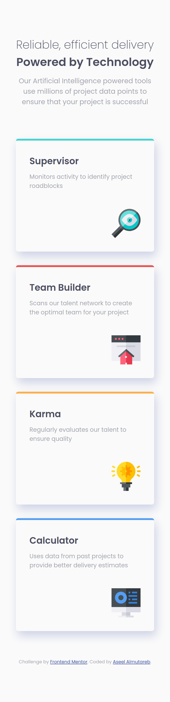

# Grid Design Challenge

This is a solution to the [Four card feature section challenge on Frontend Mentor](https://www.frontendmentor.io/challenges/four-card-feature-section-weK1eFYK).

(Frontend Mentor challenges help improve coding skills by building realistic projects.) 

## Table of contents

- [Overview](#overview)
  - [The challenge](#the-challenge)
  - [Screenshot](#screenshot)
- [My process](#my-process)
  - [Built with](#built-with)
  - [Continued development](#continued-development)
- [Author](#author)

## Overview

### The challenge

Users should be able to:

- View the optimal layout for the site depending on their device's screen size (1440px, 375px).

### Screenshot

## My process

### Built with

- Semantic HTML5 markup
- CSS custom properties
- Flexbox
- CSS Grid
- Desktop-first workflow

### Continued development

The design is not fully responsive and I want to improve myself on that in future projects. 

## Author

- Frontend Mentor - [@aseelalmutareb](https://www.frontendmentor.io/profile/aseelalmutareb)

